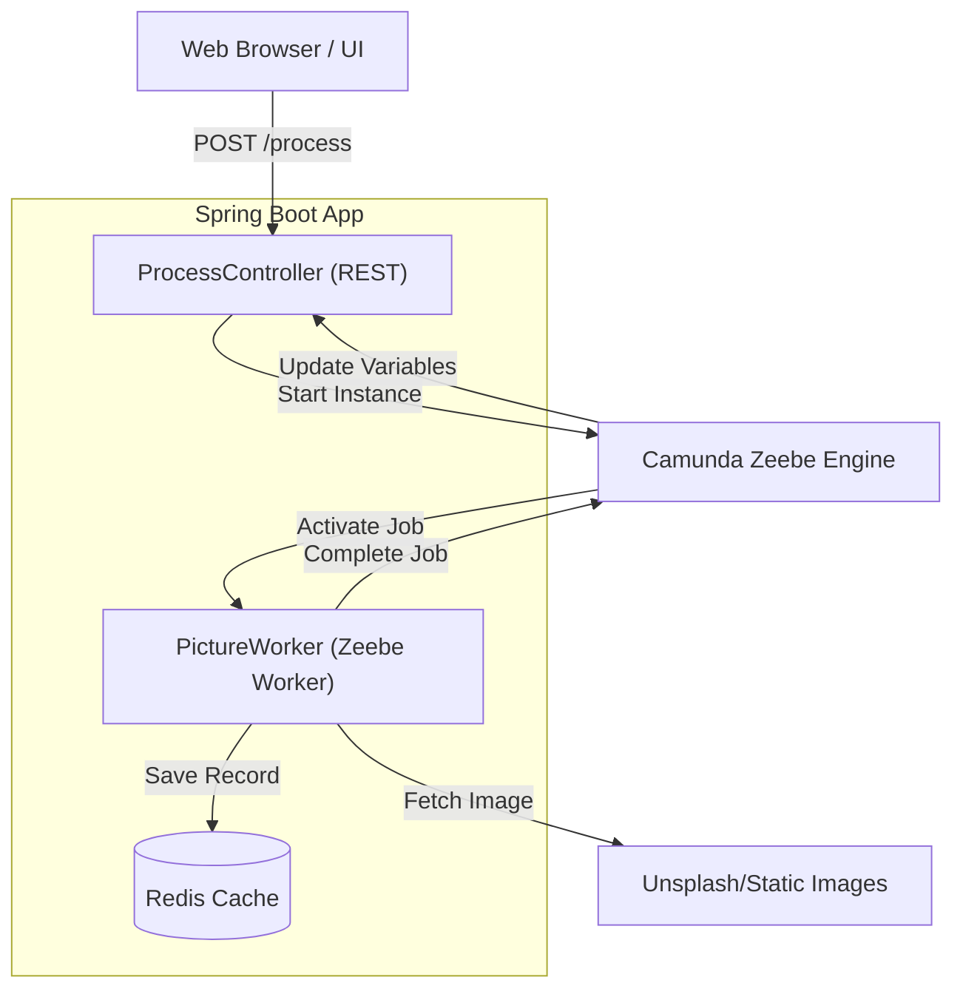
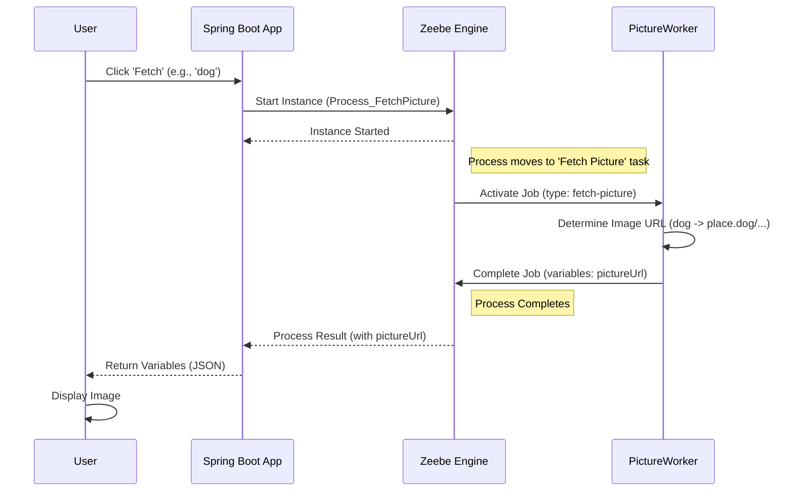

# System Architecture

The Camunda Client Application is a Spring Boot service that interacts with the Camunda 8 Zeebe engine to execute business processes.

## Component Overview

The following diagram illustrates the high-level components and their interactions:

### 1. Web UI
A simple frontend built with HTML and JavaScript. It allows users to select an animal and triggers the process via the REST API.

### 2. Spring Boot Application
Acting as both a process initiator and an external worker:
- **REST Controller (`ProcessController`)**: Receives requests to start a process instance and awaits the result (Synchronous pattern).
- **Job Worker (`PictureWorker`)**: Subscribes to tasks of type `fetch-picture`, determines the correct image URL based on logic, and completes the task.

### 3. Camunda Zeebe Engine
The orchestration engine. It can be running locally (Docker Compose/Kubernetes) or in the Camunda SaaS environment.

---

## Process Flow: Fetch Picture

The following sequence diagram shows the end-to-end flow when a user requests a picture:

---

## Deployment Architectures

### Local Development (Docker Compose)
App and Zeebe run as containers. Communication happens over a Docker network using `zeebe:26500`.

### Local Development (Kubernetes)
Both the App and a standalone Zeebe Broker are deployed as pods. The app connects to the `zeebe-gateway` service.

### SaaS Deployment
The app runs locally (or in Kubernetes) and connects to a secure remote cluster managed by Camunda via TLS (port 443).
